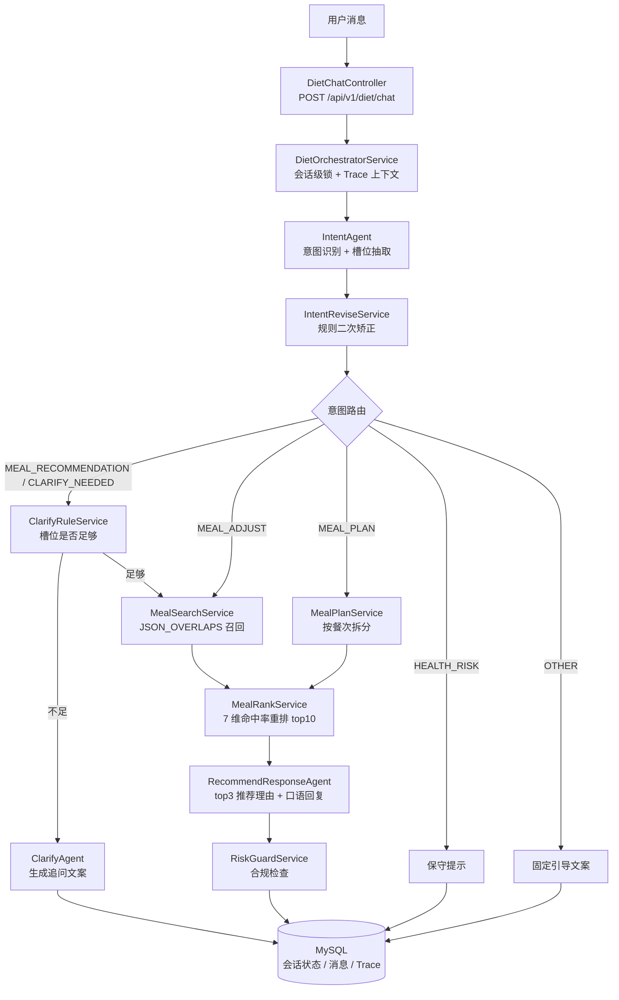

# diet-agent · 饮食推荐多 Agent 服务

一个面向「今天吃什么」场景的任务型对话助手：把用户一句口语化的表达，经过意图识别、槽位澄清、餐食检索重排，最终变成**有理由、有卡片、可追溯、可评估**的推荐结果。

> 架构取向：**Java 规则主干 + LLM 组件**。状态机、是否需要追问、是否拦截风险由确定性代码决定，LLM 只负责语义理解与自然语言表达——不把流程交给概率模型。

---

## 目录

- [核心特性](#核心特性)
- [整体架构](#整体架构)
- [一轮对话的处理链路](#一轮对话的处理链路)
- [Agent 分工](#agent-分工)
- [意图与状态机](#意图与状态机)
- [7 维槽位](#7-维槽位)
- [Trace 与离线评估](#trace-与离线评估)
- [技术栈](#技术栈)
- [快速开始](#快速开始)
- [接口一览](#接口一览)
- [目录结构](#目录结构)
- [已知限制](#已知限制)

---

## 核心特性

| 能力 | 说明 |
| --- | --- |
| 意图路由 + 状态机 | 6 种意图 × 4 个会话阶段，每轮按状态决定处理分支 |
| 7 维槽位多轮累积 | 本轮非空覆盖、本轮为空保留历史，支持"换一批""清淡点"这类增量表达 |
| 检索与生成分离 | MySQL `JSON_OVERLAPS` 召回 → Java 按命中率重排 → 只让 LLM 在候选内挑选，从结构上避免编造餐食 |
| 规则判定 + LLM 措辞 | 是否追问由 `ClarifyRuleService` 决定，LLM 只把追问写得像人话 |
| 全链路 Trace | 一轮请求的所有状态机事件、模型调用、token 与耗时落库，可回放 |
| 离线评估闭环 | 人工标注 + 规则指标 + LLM Judge + 用户反馈加权，输出可比较的报告 |
| 风险守卫 | 医疗承诺、极端节食、绝对化表述、特殊人群一律拦截并替换为保守文案 |
| 双模型分工 | 意图/澄清/Judge 用轻量模型，推荐理由与应答用主模型，兼顾成本与延迟 |
| 降级兜底 | LLM 异常时回退模板理由与模板话术，JSON 解析容错剥离 Markdown 围栏 |

---

## 整体架构



分层职责：

| 层 | 包 | 职责 |
| --- | --- | --- |
| 接口层 | `controller` | 参数透传、`X-User-Id` 解析，不含业务逻辑 |
| 编排层 | `service.orchestrator` | 唯一的流程决策者，独占写入会话状态 |
| 能力层 | `service.*` | 意图、澄清、检索、重排、规划、风险、反馈各自的原子能力 |
| Agent 层 | `agent` + `resources/diet/prompts` | Prompt 外置为 txt，Builder 构建 ReActAgent，工厂按会话缓存 |
| 可观测层 | `service.trace` / `service.evaluation` | Trace 采集、标注、指标计算 |

---

## 一轮对话的处理链路

1. **加载会话** — 按 `sessionId` 读取 `diet_sessions`，不存在则创建（`SessionPhase.START`）。
2. **开启 Trace** — `ThreadLocal` 绑定 `TraceScope`，本轮所有事件挂到同一个 `traceId`。
3. **会话级加锁** — 同一 `sessionId` 串行处理，不同会话并行。
4. **记录用户消息** — 写入 `diet_messages`。
5. **前置校验** — `PERSONAL` 模式且个人餐食库为空时直接引导，不进入检索。
6. **意图识别 + 矫正** — LLM 出 `intent/slots/confidence`，再由 `IntentReviseService` 按规则修正（见下节）。
7. **路由分发** — 推荐 / 调整 / 多餐规划 / 健康风险 / 闲聊。
8. **推荐流水线** — 合并槽位 → 澄清判定 → 检索 → 重排 → LLM 生成理由与话术 → 风险守卫。
9. **落库返回** — 保存会话状态与助手消息，`TraceScope` 关闭时整轮 Trace 落库。

**意图矫正规则**（`IntentReviseService`）——这是"不让 LLM 单独决定流程"的典型体现：

- 命中健康风险关键词 → 强制 `HEALTH_RISK`，即使模型置信度很高也不放行
- 没有历史推荐却判为 `MEAL_ADJUST` → 降级为 `MEAL_RECOMMENDATION`（没有可排除的对象）
- 命中"三餐/早中晚/一周饮食" → 强制 `MEAL_PLAN`
- 推荐意图置信度低于 `0.4` → 降级为 `CLARIFY_NEEDED`，先问清楚再推荐

---

## Agent 分工

| Agent | 模型 | 职责 | 输出 |
| --- | --- | --- | --- |
| `IntentAgent` | qwen-turbo | 意图分类 + 从槽位字典中抽取标签 | `{intent, slots, confidence}` |
| `ClarifyAgent` | qwen-turbo | 把缺失字段写成一句自然的追问 | 纯文本 |
| `RecommendResponseAgent` | qwen-max | 基于 top3 候选生成推荐理由与口语化回复 | `{recommendations[], speechText}` |
| `PlanResponseAgent` | qwen-max | 多餐规划场景下的逐餐理由与统包话术 | `{recommendations[], speechText}` |
| `EvaluationJudgeAgent` | qwen-turbo | 离线评估中给"解释质量/自然度"打 1–5 分 | `{explanationQuality, naturalness, reason}` |

Prompt 全部外置在 `src/main/resources/diet/prompts/*.txt`，改 Prompt 不需要重新编译代码；`AgentFactory` 的缓存键包含 `diet.prompt.version`，升级版本号即可让旧会话的 Agent 实例自动失效。

---

## 意图与状态机

**意图** `Intent`：`MEAL_RECOMMENDATION`（推荐）、`CLARIFY_NEEDED`（信息不足需追问）、`MEAL_ADJUST`（调整上轮推荐）、`MEAL_PLAN`（多餐规划）、`HEALTH_RISK`（健康风险）、`OTHER`（与饮食无关）。

**会话阶段** `SessionPhase`：`START` → `CLARIFY` → `RECOMMEND` / `PLAN`，决定下一轮上下文如何被解释。

`SessionState` 为不可变对象，通过 `withPhase/withIntent/withSlots/appendLastRecommendations` 生成新状态；`lastRecommendations` 会跨轮累积去重，用于"换一批"时不重复推荐。

---

## 7 维槽位

| 槽位 | 示例值 |
| --- | --- |
| `mealTime` | 早餐 / 午餐 / 晚餐 / 夜宵 / 三餐 |
| `mood` | 疲惫 / 烦躁 / 开心 / 焦虑 / 没胃口 |
| `scene` | 工作 / 校园 / 家里 / 加班 / 聚餐 / 独处 |
| `healthGoal` | 减脂 / 清淡 / 养胃 / 高蛋白 / 低糖 |
| `cuisine` | 川菜 / 粤菜 / 轻食 / 日料 / 家常 |
| `taste` | 清淡 / 辣 / 酸甜 / 咸鲜 / 番茄味 |
| `convenience` | 快速 / 一人食 / 少餐具 / 适合备餐 |

标签字典来自数据库表 `diet_slot_option`，可通过 `GET /api/v1/diet/slot-options` 获取。**LLM 只能在该字典内取值**，抽不到的字段填 `null`，不允许自造标签（`SlotJsonPicker` 会二次过滤）。

澄清规则：`mealTime` 为空必问；`healthGoal` 为空且没有明确的菜系/口味/场景/便捷偏好时也必问；其余槽位缺失不阻塞推荐。

---

## Trace 与离线评估

### Trace 采集

每轮请求生成一个 `traceId`，`AgentTraceService` 用 `TraceScope` 收集事件并在请求结束时整体写入 `diet_request_trace`（`trace_json` 存全量事件，单条 payload 超过 20000 字符截断）。典型事件序列：

```
REQUEST_RECEIVED → USER_MESSAGE_RECORDED → INTENT_RECOGNIZED → INTENT_REVISED
→ ROUTE_SELECTED → SLOTS_MERGED → CLARIFY_DECISION → MEAL_SEARCHED → MEAL_RANKED
→ RECOMMEND_RESULT_BUILT → RESPONSE_AGENT_RESULT → NUTRITION_GUARD_CHECKED
→ RESPONSE_READY → REQUEST_FINISHED
```

每次模型调用额外记录 `AGENT_CALL` 事件，包含 `agentName`、`modelName`、输入输出 token 与耗时。

### 评估指标

`POST /api/v1/diet/evaluations` 按时间窗口回放 Trace 并计算指标。**缺少标注的指标返回 `null` 而不是 0 分**，避免未标注数据把均分拉低。

| 指标 | 含义 |
| --- | --- |
| `intentAccuracy` | 与人工标注的标准意图是否一致 |
| `slotAccuracy` | 逐槽位与标注答案的集合一致率 |
| `clarifyNecessityAccuracy` | `ASK / READY` 判定是否与标注一致 |
| `tokenCostScore` | ≤1000 token 满分，≥3000 归零，中间线性衰减 |
| `latencyScore` | ≤3s 满分，≥8s 归零，中间线性衰减 |
| `fallbackScore` | 是否走了降级/异常链路 |
| `safetyCompliance` | 最终回复是否出现禁用表述 |
| `hallucinationControl` | 展示卡片是否全部来自重排候选集合 |
| `multiTurnConsistency` | 调整链路是否复用了上下文且未重复推荐 |
| `explanationQuality` / `naturalness` | LLM Judge 打分（1–5） |

总分按维度加权，并**按实际可用的维度归一化**：规则分 60% + Judge 分 10% + 用户反馈分 30%。

---

## 技术栈

| 组件 | 版本 / 选型 |
| --- | --- |
| 语言 / 构建 | Java（`pom.xml` 声明 21，用 JDK 17 编译亦可）、Maven |
| 框架 | Spring Boot 3.3.13 |
| Agent 框架 | AgentScope 1.0.11（`ReActAgent`） |
| 模型服务 | 阿里云百炼 DashScope（`qwen-max` / `qwen-turbo`） |
| 持久层 | MyBatis 3.0.4 + MySQL 8（JSON 字段 + `JSON_OVERLAPS`） |
| 前端 | 原生 HTML/CSS/JS 单页应用，无框架依赖 |
| 工具 | Lombok、Hutool |

---

## 快速开始

### 1. 环境要求

- JDK 17 或 21
- MySQL 8.0+
- Maven 3.8+

### 2. 建库并导入表结构

```bash
mysql -u root -p -e "CREATE DATABASE diet_db DEFAULT CHARACTER SET utf8mb4 COLLATE utf8mb4_unicode_ci;"
mysql -u root -p --default-character-set=utf8mb4 diet_db < src/main/resources/db/diet_db.sql
```

导入后会得到 6 张表：`diet_sessions`、`diet_messages`、`diet_slot_option`、`meal_item`、`recommend_feedback`、`diet_request_trace`。

### 3. 配置密钥

仓库里的 `application.yml` 只保留占位符，真实的数据库密码与 DashScope api-key 请写在**不会提交**的本地文件里：

`src/main/resources/application-local.yml`

```yaml
spring:
  datasource:
    password: 你的MySQL密码

agentscope:
  dashscope:
    api-key: 你的DashScope apiKey
```

该文件已被 `.gitignore` 排除，并由 `application.yml` 中的
`spring.config.import: optional:classpath:application-local.yml` 自动加载。

### 4. 启动

```bash
mvn spring-boot:run
```

若本机只有 JDK 17 而 pom 声明为 21，可用命令行覆盖编译目标（无需改动 pom）：

```bash
mvn -Dmaven.compiler.source=17 -Dmaven.compiler.target=17 clean package
java -jar target/diet-agent-1.0-SNAPSHOT.jar
```

### 5. 访问

浏览器打开 <http://localhost:8080> ，页面内置 6 个入口：首页、聊天推荐、个人餐食、公共餐食、Trace 调试、评估报告。右上角的「用户 ID」对应请求头 `X-User-Id`，个人餐食与评估数据按用户隔离。

---

## 接口一览

所有接口以 `X-User-Id` 请求头标识用户（缺省为 `1`）。

| 方法 | 路径 | 说明 |
| --- | --- | --- |
| `POST` | `/api/v1/diet/sessions` | 创建会话，返回 `sessionId` |
| `POST` | `/api/v1/diet/chat` | 对话主入口，返回澄清追问或推荐卡片 |
| `GET` | `/api/v1/diet/slot-options` | 获取 7 维槽位字典 |
| `GET` | `/api/v1/diet/meals/personal` | 查询个人餐食 |
| `POST` | `/api/v1/diet/meals/personal` | 新增个人餐食 |
| `PUT` | `/api/v1/diet/meals/personal/{mealId}` | 修改个人餐食 |
| `DELETE` | `/api/v1/diet/meals/personal/{mealId}` | 删除个人餐食 |
| `GET` | `/api/v1/diet/meals/public` | 查询公共餐食 |
| `POST` | `/api/v1/diet/feedback` | 提交点赞/点踩/评分反馈 |
| `POST` | `/api/v1/diet/evaluations` | 按时间窗口生成离线评估报告 |
| `GET` | `/api/v1/diet/debug/traces/{traceId}` | 按 traceId 查看链路详情 |
| `GET` | `/api/v1/diet/debug/sessions/{sessionId}/traces` | 按会话查看最近 Trace |
| `GET` | `/api/v1/diet/debug/traces` | 按时间范围查询 Trace |
| `PUT` | `/api/v1/diet/debug/traces/{traceId}/label` | 写入人工标注（期望意图/槽位/澄清动作） |

对话请求示例：

```bash
curl -X POST http://localhost:8080/api/v1/diet/chat \
  -H "Content-Type: application/json" \
  -H "X-User-Id: 1" \
  -d '{"sessionId":"sess_xxx","message":"中午想吃点清淡的","sourceMode":"PUBLIC"}'
```

---

## 目录结构

```
src/main/java/com/diet
├── agent/               # Prompt 加载、Builder、按会话缓存的 AgentFactory
├── config/              # AgentScope 模型（主模型 / 轻量模型）配置
├── constants/           # 常量
├── controller/          # HTTP 入口：chat / session / meal / slot / feedback / trace / evaluation
├── enums/               # Intent、SessionPhase、ClarifyAction、RiskLevel、SourceMode
├── exception/           # 业务异常与全局异常处理
├── mapper/              # MyBatis Mapper 接口
├── model/               # 请求/响应/领域模型（含 SessionState、SlotBundle、Trace 行对象）
├── service/
│   ├── orchestrator/    # 状态机主流程
│   ├── intent/          # 意图识别与规则矫正
│   ├── clarify/         # 澄清规则与追问生成
│   ├── slot/            # 槽位字典与合并
│   ├── meal/            # 检索、重排、餐食 CRUD
│   ├── plan/            # 多餐规划
│   ├── recommend/       # 推荐理由与应答生成
│   ├── risk/            # 营养健康风险守卫
│   ├── session/         # 会话与消息持久化
│   ├── trace/           # 链路追踪
│   ├── evaluation/      # 离线评估与 LLM Judge
│   └── feedback/        # 用户反馈
└── util/                # JSON 工具、LLM 输出解析、槽位过滤

src/main/resources
├── application.yml      # 占位符配置
├── db/diet_db.sql       # 建表 + 示例数据
├── diet/prompts/*.txt   # 各 Agent 的 Prompt
├── mapper/*.xml         # MyBatis SQL
└── static/              # 单页前端（index.html + assets）
```

---

## 已知限制

- 各 Agent 目前是**单轮结构化调用**，没有挂载工具调用循环；流程推进依赖 Orchestrator 状态机，属于受控 workflow 而非自主 Agent。
- `recommend_feedback` 表中没有 `traceId`，反馈只能按 `sessionId` 近似归因，同一会话内多条 Trace 会共享同一批反馈。
- 会话锁是单机内存锁（`ConcurrentHashMap`），多实例部署下不成立。
- 风险关键词与澄清规则目前硬编码在 Java 中，扩展需要改代码。
- `pom.xml` 声明 Java 21，但早期构建产物为 Java 17 字节码，构建环境尚未统一。

